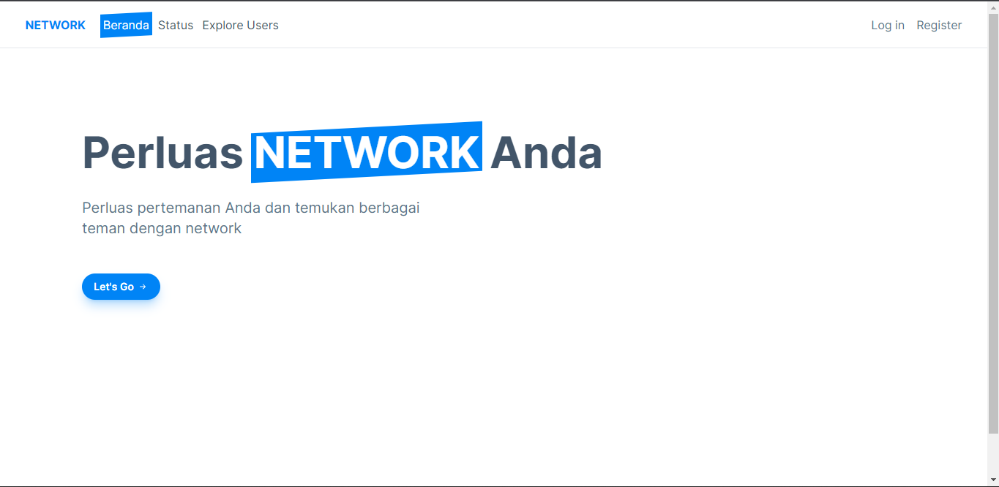

# NETWORK

Ini adalah aplikasi untuk memperluas pertemanan yang dibuat dengan menggunakan teknologi TALL stack

## Screenshots



## Tutorial cara Setup

### Install project Laravel

Install project dengan laravel installer atau composer

#### Install Laravel dengan laravel installer

```bash
  laravel new network
  cd network
```

#### Install Laravel dengan composer

```bash
  composer create-project laravel/laravel network
  cd network
```

#### Jalankan aplikasi

```bash
  php artisan serve
```

### Install TALL stack, Installation (with auth)

```bash
  composer require livewire/livewire laravel-frontend-presets/tall
  php artisan ui tall --auth
  npm install
  npm run dev
```
